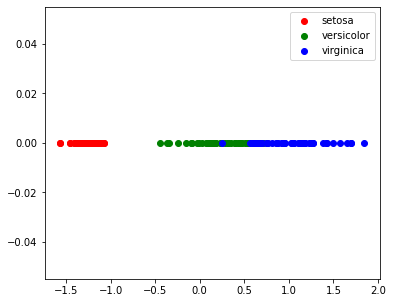
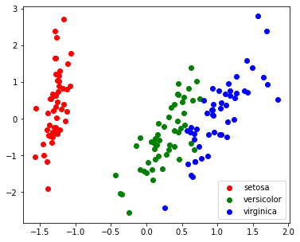
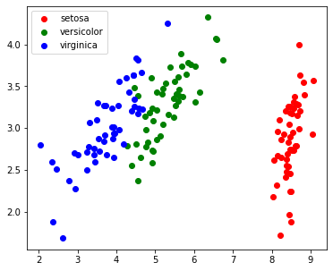
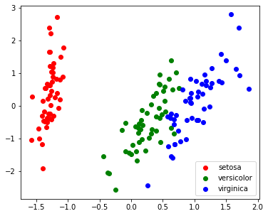

## Import Packages


```
import numpy as np
import matplotlib.pyplot as plt
%matplotlib inline
from tqdm.notebook import tqdm
```

https://scipy-lectures.org/packages/scikit-learn/auto_examples/plot_pca.html


https://scikit-learn.org/stable/modules/decomposition.html


```
from sklearn import datasets
iris = datasets.load_iris()
X = iris.data
y = iris.target
```


```
X.shape, y.shape
```


    ((150, 4), (150,))


```
from sklearn.decomposition import PCA
pca = PCA(n_components=0.9, whiten=True)
pca.fit(X)
```


    PCA(copy=True, iterated_power='auto', n_components=0.9, random_state=None,
        svd_solver='auto', tol=0.0, whiten=True)


```
pca.explained_variance_ratio_
```


    array([0.92461872])


```
X_pca = pca.transform(X)
```


```
X_pca.shape
```


    (150, 1)


```
target_ids = range(len(iris.target_names))
plt.figure(figsize=(6,5))
for i, c, label in zip(target_ids, 'rgbcmykw', iris.target_names):
  plt.scatter(X_pca[y==i, 0], np.zeros(X_pca[y==i].shape), c=c, label=label)
plt.legend()
plt.show()
```





```
pca = PCA(n_components=2, whiten=True)
pca.fit(X)
X_pca = pca.transform(X)
target_ids = range(len(iris.target_names))
plt.figure(figsize=(6,5))
for i, c, label in zip(target_ids, 'rgbcmykw', iris.target_names):
  plt.scatter(X_pca[y==i, 0], X_pca[y==i, 1], c=c, label=label)
plt.legend()
plt.show()
```





## PCA Implementation


### Playground


```
N, d = X.shape
```


```
# Sigma = np.mean([np.matmul(np.expand_dims(X[i], axis=1), np.expand_dims(X[i], axis=1).T) for i in range(N)], axis=0)
# Sigma
```


```
# Sigma = np.dot(X.T, X) / (N-1)
# Sigma
```


```
X.mean(axis=0)
```


    array([5.84333333, 3.05733333, 3.758     , 1.19933333])


```
# X.std(axis=0)
```


```
# X_prime = (X - X.mean(axis=0)) / X.std(axis=0)
```


```
X_prime = X - X.mean(axis=0)
```


```
Sigma = np.dot(X_prime.T, X_prime) / (N-1)
Sigma
```


    array([[ 0.68569351, -0.042434  ,  1.27431544,  0.51627069],
           [-0.042434  ,  0.18997942, -0.32965638, -0.12163937],
           [ 1.27431544, -0.32965638,  3.11627785,  1.2956094 ],
           [ 0.51627069, -0.12163937,  1.2956094 ,  0.58100626]])


```
U, Lambda, V = np.linalg.svd(Sigma)
```


```
Lambda
```


    array([4.22824171, 0.24267075, 0.0782095 , 0.02383509])


```
Sigma_new = np.matmul(np.expand_dims(U[:,0],axis=1), np.expand_dims(V[0],axis=1).T) * Lambda[0] + np.matmul(np.expand_dims(U[:,1],axis=1), np.expand_dims(V[1],axis=1).T) * Lambda[1] 
Sigma_new
```


    array([[ 0.656827  , -0.01281273,  1.28139395,  0.53544983],
           [-0.01281273,  0.15958324, -0.33687803, -0.14142037],
           [ 1.28139395, -0.33687803,  3.11033538,  1.30097452],
           [ 0.53544983, -0.14142037,  1.30097452,  0.54416683]])


```
# X_prime_new = np.dot(np.pad(U[:, :2], pad_width=[(0,0),(0,2)]), X_prime.T).T[:, :2]
```


```
U[:,:2]
```


    array([[-0.36138659, -0.65658877],
           [ 0.08452251, -0.73016143],
           [-0.85667061,  0.17337266],
           [-0.3582892 ,  0.07548102]])


```
X_prime_new = np.dot(U[:,:2].T, X_prime.T).T
```


```
X_new = X_prime_new+X.mean(axis=0)[:2]
```


```
plt.figure(figsize=(6,5))
for i, c, label in zip(target_ids, 'rgbcmykw', iris.target_names):
  plt.scatter(X_new[y==i, 0], X_new[y==i, 1], c=c, label=label)
plt.legend()
plt.show()
```





### Construct a PCA function


```
def myPCA(X:np.ndarray, n_dimensions:int):
  N, d = X.shape

  # Centering
  X_centered = X - X.mean(axis=0) 

  # Covariance Matrix of d*d
  Sigma = np.dot(X_centered.T, X_centered)

  # SVD
  U, Lambda, V = np.linalg.svd(Sigma)

  X_centered_PC = np.dot(U[:,:n_dimensions].T, X_centered.T).T
  X_PC = X_centered_PC + X.mean(axis=0)[:n_dimensions]

  # Purposely rescale and add negative sign to mimic Scipy's PCA
  return -(X_PC - X_PC.mean(axis=0))/X_PC.std(axis=0) 

```


```
X_PC2 = myPCA(X, 2)

plt.figure(figsize=(6,5))
for i, c, label in zip(target_ids, 'rgbcmykw', iris.target_names):
  plt.scatter(X_PC2[y==i, 0], X_PC2[y==i, 1], c=c, label=label)
plt.legend()
plt.show()
```





```
pca = PCA(n_components=2, whiten=True)
pca.fit(X)
X_pca = pca.transform(X)
target_ids = range(len(iris.target_names))
plt.figure(figsize=(6,5))
for i, c, label in zip(target_ids, 'rgbcmykw', iris.target_names):
  plt.scatter(X_pca[y==i, 0], X_pca[y==i, 1], c=c, label=label)
plt.legend()
plt.show()
```


```
%cd /content/drive/My Drive/CS229
```

    /content/drive/My Drive/CS229


```
ls
```

    Notes10-PCA/  Notes11-ICA/


```
!jupyter nbconvert --to markdown CS229-Notes10-Principal-components-analysis.ipynb 
```

    [NbConvertApp] WARNING | pattern u'CS229-Notes10-Principal-components-analysis.ipynb' matched no files
    This application is used to convert notebook files (*.ipynb) to various other
    formats.
    
    WARNING: THE COMMANDLINE INTERFACE MAY CHANGE IN FUTURE RELEASES.
    
    Options
    -------
    
    Arguments that take values are actually convenience aliases to full
    Configurables, whose aliases are listed on the help line. For more information
    on full configurables, see '--help-all'.
    
    --execute
        Execute the notebook prior to export.
    --allow-errors
        Continue notebook execution even if one of the cells throws an error and include the error message in the cell output (the default behaviour is to abort conversion). This flag is only relevant if '--execute' was specified, too.
    --no-input
        Exclude input cells and output prompts from converted document. 
        This mode is ideal for generating code-free reports.
    --stdout
        Write notebook output to stdout instead of files.
    --stdin
        read a single notebook file from stdin. Write the resulting notebook with default basename 'notebook.*'
    --inplace
        Run nbconvert in place, overwriting the existing notebook (only 
        relevant when converting to notebook format)
    -y
        Answer yes to any questions instead of prompting.
    --clear-output
        Clear output of current file and save in place, 
        overwriting the existing notebook.
    --debug
        set log level to logging.DEBUG (maximize logging output)
    --no-prompt
        Exclude input and output prompts from converted document.
    --generate-config
        generate default config file
    --nbformat=<Enum> (NotebookExporter.nbformat_version)
        Default: 4
        Choices: [1, 2, 3, 4]
        The nbformat version to write. Use this to downgrade notebooks.
    --output-dir=<Unicode> (FilesWriter.build_directory)
        Default: ''
        Directory to write output(s) to. Defaults to output to the directory of each
        notebook. To recover previous default behaviour (outputting to the current
        working directory) use . as the flag value.
    --writer=<DottedObjectName> (NbConvertApp.writer_class)
        Default: 'FilesWriter'
        Writer class used to write the  results of the conversion
    --log-level=<Enum> (Application.log_level)
        Default: 30
        Choices: (0, 10, 20, 30, 40, 50, 'DEBUG', 'INFO', 'WARN', 'ERROR', 'CRITICAL')
        Set the log level by value or name.
    --reveal-prefix=<Unicode> (SlidesExporter.reveal_url_prefix)
        Default: u''
        The URL prefix for reveal.js (version 3.x). This defaults to the reveal CDN,
        but can be any url pointing to a copy  of reveal.js.
        For speaker notes to work, this must be a relative path to a local  copy of
        reveal.js: e.g., "reveal.js".
        If a relative path is given, it must be a subdirectory of the current
        directory (from which the server is run).
        See the usage documentation
        (https://nbconvert.readthedocs.io/en/latest/usage.html#reveal-js-html-
        slideshow) for more details.
    --to=<Unicode> (NbConvertApp.export_format)
        Default: 'html'
        The export format to be used, either one of the built-in formats
        ['asciidoc', 'custom', 'html', 'latex', 'markdown', 'notebook', 'pdf',
        'python', 'rst', 'script', 'slides'] or a dotted object name that represents
        the import path for an `Exporter` class
    --template=<Unicode> (TemplateExporter.template_file)
        Default: u''
        Name of the template file to use
    --output=<Unicode> (NbConvertApp.output_base)
        Default: ''
        overwrite base name use for output files. can only be used when converting
        one notebook at a time.
    --post=<DottedOrNone> (NbConvertApp.postprocessor_class)
        Default: u''
        PostProcessor class used to write the results of the conversion
    --config=<Unicode> (JupyterApp.config_file)
        Default: u''
        Full path of a config file.
    
    To see all available configurables, use `--help-all`
    
    Examples
    --------
    
        The simplest way to use nbconvert is
        
        > jupyter nbconvert mynotebook.ipynb
        
        which will convert mynotebook.ipynb to the default format (probably HTML).
        
        You can specify the export format with `--to`.
        Options include ['asciidoc', 'custom', 'html', 'latex', 'markdown', 'notebook', 'pdf', 'python', 'rst', 'script', 'slides'].
        
        > jupyter nbconvert --to latex mynotebook.ipynb
        
        Both HTML and LaTeX support multiple output templates. LaTeX includes
        'base', 'article' and 'report'.  HTML includes 'basic' and 'full'. You
        can specify the flavor of the format used.
        
        > jupyter nbconvert --to html --template basic mynotebook.ipynb
        
        You can also pipe the output to stdout, rather than a file
        
        > jupyter nbconvert mynotebook.ipynb --stdout
        
        PDF is generated via latex
        
        > jupyter nbconvert mynotebook.ipynb --to pdf
        
        You can get (and serve) a Reveal.js-powered slideshow
        
        > jupyter nbconvert myslides.ipynb --to slides --post serve
        
        Multiple notebooks can be given at the command line in a couple of 
        different ways:
        
        > jupyter nbconvert notebook*.ipynb
        > jupyter nbconvert notebook1.ipynb notebook2.ipynb
        
        or you can specify the notebooks list in a config file, containing::
        
            c.NbConvertApp.notebooks = ["my_notebook.ipynb"]
        
        > jupyter nbconvert --config mycfg.py
    

